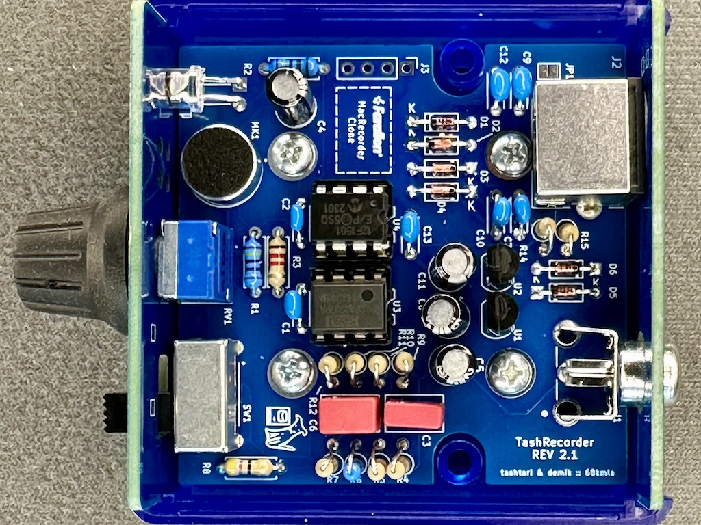

# TashRecorder

This is a simple (but dense) design, using all through hole components.  It's designed this way to be period correct and easy to build for people who don't like soldering SMT components.

This folder contains the source KiKad files for the main board. Please check the Panels subfolder for the FR-4 front and back plates.

## BOM
### Mandatory

Here is the BOM for the main board. Part number are what was tested on prototypes board but you may find alternatives easily, especially resistors and sockets

| Reference(s)          | Value      | Quantity | Notes                                  | Part number              |
|-----------------------|------------|----------|----------------------------------------|--------------------------|
| C1, 2, 7, 9-10, 12-13 | 100nF      | 7        | ceramic capacitor 5.08mm               | Weltron 453358           |
| C3                    | 6800pF     | 1        | film capacitor 5mm                     | Wima FKS2G016801B00KSSD  |
| C8                    | 680pF      | 1        | film capacitor 5mm                     | Wima FKP2J006801D00HSSD  |
| C4, C5, C8, C11       | 22uF       | 4        | aluminium electrolytic capacitor       | Panasonic ECA-1HHG220I   |
| D1 to D6              | 1N4148     | 6        | general purpose switching diode        | Vishay 1N4148-TAP        |
| D7                    | Red        | 1        | High efficiency 20000-30000mcd 5mm LED | TRU TC-10551696          |
| J1                    | RCA        | 1        | RCA Phono Connector                    | CUI Devices RCJ-013      |
| J2                    | Connector  | 1        | Circular Mini-DIN Connectors 8P        | Kycon KMDGX-8S-AS        |
| MK1                   | Micro      | 1        | omnidirectional electret microphone    | DB Unlimited MO093803-1  |
| R1, R2, R6            | 2.4kΩ      | 3        | standard 0.25W metal film resistor     | TRU MF0W4FF2401          |
| R3, R12               | 1.2kΩ      | 2        | standard 0.25W carbon film resistor    | TRU CFR0W4J0122          |
| R4, R5, R7, R9        | 220kΩ      | 4        | standard 0.25W carbon film resistor    | TRU CFR0W4J0224          |
| R8, R14, R15          | 47Ω        | 3        | standard 0.25W carbon film resistor    | TRU CFR0W4J0470          |
| R10                   | 4.7kΩ      | 1        | standard 0.25W carbon film resistor    | TRU CFR0W4J0472          |
| R11                   | 10kΩ       | 1        | standard 0.25W carbon film resistor    | TRU CFR0W4J0103          |
| RV1                   | 100kΩ      | 1        | audio 100kΩ panel potentiometer        | Bourns PTD901-2015K-A104 |
| SW1                   | SPDT       | 1        | slide switches right angle             | E-Switch EG1224          |
| U1, U2                | 2.5V       | 2        | 2.5V TO-92-3 20mA voltage reference    | ON Semi LM385Z-2.5       |
| U3                    | OPA2337    | 1        | low power RR out CMOS op-amp           | Texas OPA2337PA          |
| U4                    | PIC        | 1        | 8-bit Microcontrollers DIP PIC12F1501  | MC PIC12F1501-I/P        |
| Case                  | ABS        | 1        | Instrument Case, ABS 2.6x2.6"          | HM 1593K(TBU\|GY\|BK)    |
| PCB Screws            | #4         | 4        | Phillips Pan Head screws #4 x 1/4"     | SERPAC 6004              |
| Socket                | DIP-8      | 2        | DIP-8 socket                           | TRU TC-A 08-LC-TT-203    |
| Knob                  | Blue       | 1        | knob for Ø 6 mm 18 teeth shafts        | PSP 49009-BL             |

Using sockets is recommended because it will allow you to reclaim the microcontroler and op-amp. This will also allow you to upgrade the firmware if a future firmware is released.

### BOM (external links)
Here is a complete mouser. It includes lots of 10 when that was cheaper. You may have extra components
- https://www.mouser.fr/ProjectManager/ProjectDetail.aspx?AccessID=31409f3429

## PCBs
Main PCB is 4 layers. Panels are simple 2 layers boards. The gerbers are avaible in the release section.
Check for the following files:
* TashRecorder_2.1.zip: main board revision 2.1
* TashRecorder_back_panel_2.1.zip: FR-4 back panel revision 2.1
* TashRecorder_front_panel_2.1.zip: FR-4 front panel revision 2.1

You should be use any mainstream PCB manufacturer for theses. Nothing special about them. PCB thickness should be 1.6mm

On JLCPCB, select "Specify a location" to the option "Remove Order Number" for all of them

## Building
Building is straightworfard. It's recommended to start with small components first (diodes, then resistor, LED), then other components, and connectors last.
For Japanase mounted resistors, the resistor will go on the circle side